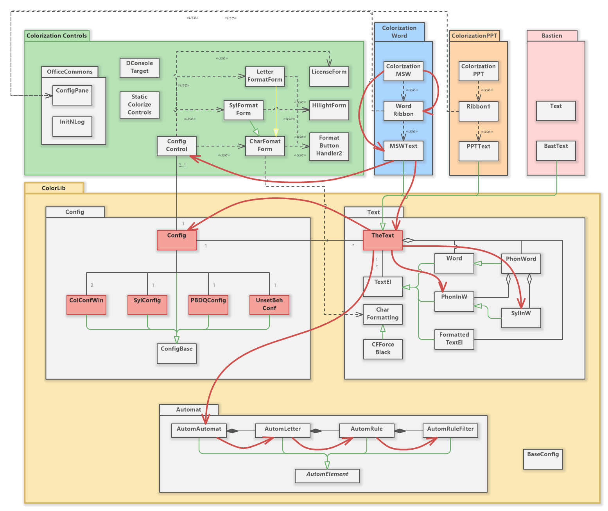

# Initialisation
Une partie des structures dont le programme a besoin sont statiques et doivent être initialisées. Le flux d'initialisation est illustré sur le schéma ci-dessous.

Dans les situations de test, il est important de s'assurer que l'initialisation a bien eu lieu. Un test de `ColorLib` commencera donc toujours par `TheText.Init()`.

