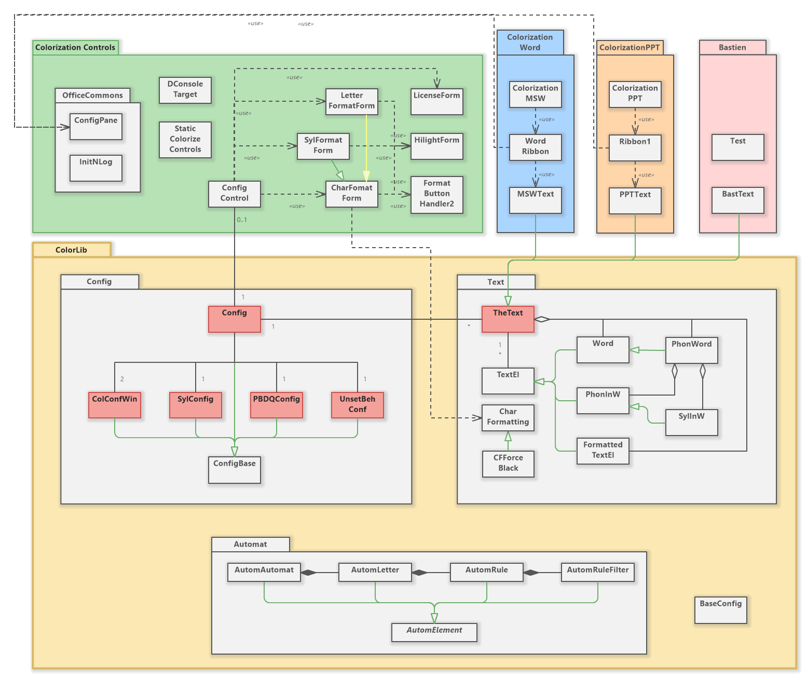

# Documentation du code de **Coloriƨation**.
## Introduction
[Coloriƨation](https://colorization.ch) est le fruit d'un besoin de mon épouse qui suit des enfants ayant des difficultés de lecture. Pour l’aider, j’ai décidé de réaliser un complément pour les programmes Office qu’elle utilise, à savoir Word et PowerPoint.

Comme je n’ai plus écrit une ligne de code depuis 25 ans, je souhaitais en profiter pour apprendre c# et j’ai donc choisi de réaliser ce complément en utilisant la technologie VSTO. Je sais, ce n’est pas l’approche la plus moderne, mais c’est ce qui me motivait…

Le programme qui est documenté ici, et dont le code se trouve sous https://github.com/paColor/Colorization, est donc mon premier projet après des décennies d’absence du domaine du codage. On y trouve donc toutes les étapes de ma progression dans l’apprentissage du langage, de la maîtrise de l’environnement, etc… Merci donc au lecteur (s’il y en a un jour 😊) pour sa bienveillance et sa compréhension.

## Structure
Le programme est composé de quatre parties principales :
1.	La librairie `ColorLib` qui contient le cœur de la logique et de la configuration du comportement du programme.
2.	La librairie `ConfigControls` qui est en charge de la partie interface utilisateur. Il s’agit d’une solution basée sur `Windows.Forms`.
3.	`ColorizationWord` contient la partie spécifique à MS-Word.
4.	`ColorizationPPT` contient la partie spécifique à PowerPoint. 

On remarquera sur le dessin ci-dessus, que `ColorLib` est lui-même partagé en trois parties relativement indépendantes :
1.	`Automat` contient les règles nécessaires à la reconnaissance de phonèmes. La logique qui s’y trouve est empruntée à LireCouleur (http://lirecouleur.arkaline.fr/ ou https://framagit.org/arkaline/lirecouleur). 
2.	`Config` regroupe les classes qui contiennent les paramètres de configuration pour le programme. 
3.	`Text` contient la partie qui manipule un texte, le découpe en mots en phonèmes, en syllabes etc…

Les classes en rouge sont celles qui servent d’interface vers l’extérieur pour l’utilisation de la fonctionnalité.
Vous trouverez plus de détails en cliquant sur « Documentation des interfaces » dans le ruban de navigation au haut de cette fenêtre. 
